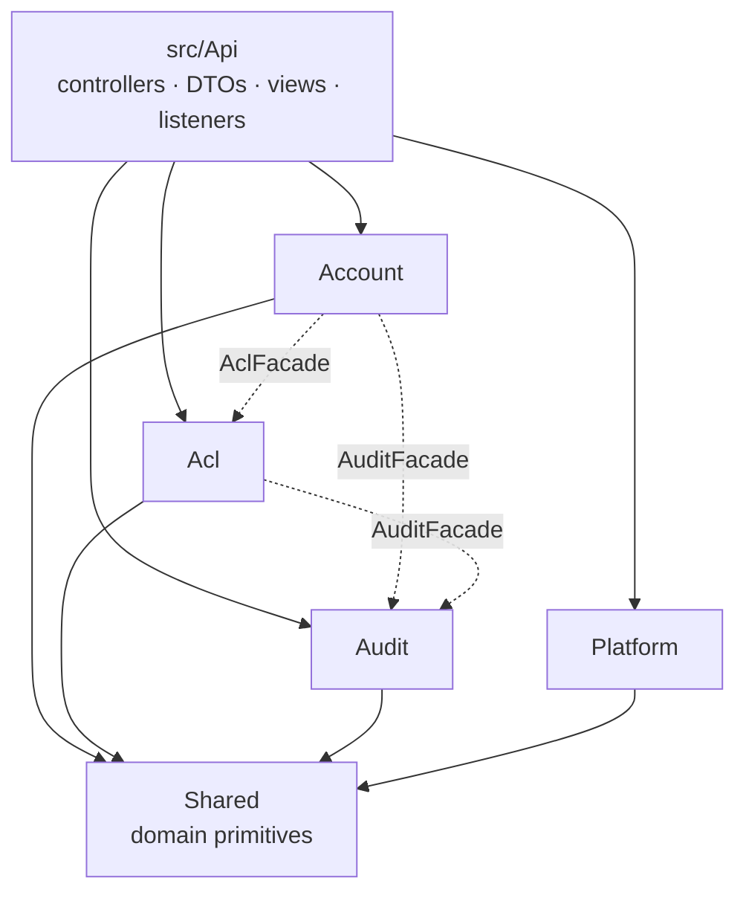
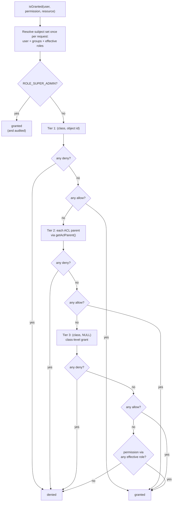
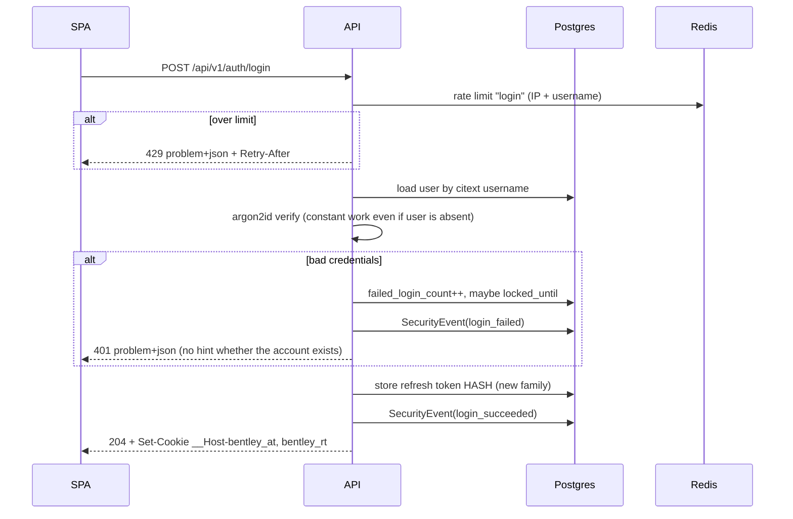
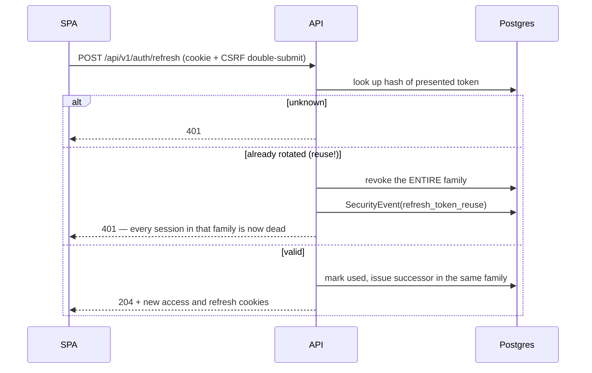

# Architecture

How the pieces fit and why they are arranged this way. Read `CLAUDE.md` and
`docs/INVARIANTS.md` first — this file explains the *shape*; those two tell you the rules.

---

## Contexts

`backend/src/` holds bounded contexts plus three non-context directories.

| Directory | Owns |
|---|---|
| `Account/` | authentication, admin-issued user provisioning and password reset, sessions and devices, token issuing and rotation |
| `Acl/` | the permission model, `PermissionResolver`, `AclCriteriaBuilder`, the permission catalog |
| `Audit/` | the append-only security event log, entity change history, GDPR export and erasure |
| `Platform/` | cross-cutting infrastructure: health checks, observability, rate limiting, request ids |
| `Shared/` | domain primitives every context may use — value objects, `Clock`, `IdGenerator` |
| `Api/` | **all** HTTP: controllers, request DTOs, response views, listeners, voters |
| `Maker/` | dev-time code generators |

Each context has `Domain/`, `Application/Service/` and `Infrastructure/`. Its HTTP surface
lives in `src/Api/<Context>/`, not inside the context — so the whole HTTP layer is one
directory you can review for authorization coverage in a single pass.

**A context may only reach another context through its `<Context>Facade`** (INV-02). `Api`
is exempt: controllers are the HTTP composition root and address contexts directly.

Dotted edges are facade calls — the only legal cross-context path.

---

## Layers

| Layer | Holds | May depend on |
|---|---|---|
| `Api` | controllers, request DTOs, response views, HTTP listeners, voters | `Application`, `Domain` |
| `Application` | service classes, ports (interfaces) | `Domain` |
| `Domain` | entities, value objects, enums, domain exceptions, repository *interfaces* | nothing |
| `Infrastructure` | Doctrine repositories, Redis / HTTP / JWT adapters | `Domain`, `Application` ports |

Enforced by `backend/deptrac.yaml`. The Domain layer's empty dependency list is the load-
bearing part: it is the only code here that survives a framework change.

---

## The life of a request

A worked example — `GET /api/v1/notes/{id}`, an endpoint requiring the object-level
permission `note.read`.

1. **FrankenPHP** receives the request and hands it to the Symfony kernel.
2. **`RequestIdSubscriber`** reads `X-Request-Id` or generates one. Everything downstream —
   logs, the audit row, the problem+json body — carries it.
3. **`TrustedProxy` handling** resolves the real client IP. Rate limiting and audit records
   are wrong without this.
4. **The authenticator** reads the `__Host-bentley_at` cookie, verifies the RS256 signature,
   and builds the security token from `sub` and `roles`. The token carries **no permission
   list** (ADR-0011).
5. **`RateLimitSubscriber`** applies the route's `#[RateLimit]` policy. Over the limit: 429
   problem+json with `Retry-After`, and the controller never runs.
6. **`#[IsGranted('note.read', subject: 'note')]`** triggers `AclVoter`, which calls
   `PermissionResolver::isGranted()`. Every endpoint has this attribute — a missing one is a
   build failure (INV-11).
7. **`PermissionResolver`** decides — see below.
8. **The controller** runs only if permitted. It maps the request DTO onto the service's
   parameters and calls it. Nothing else (INV-07).
9. **The Application service** does the work inside a transaction it owns (INV-06) and
   returns domain data. It has no idea it was reached over HTTP (INV-08).
10. **The response view** maps that result field by field. Entities are never serialized
    (INV-05).
11. **On any exception**, `ProblemJsonExceptionListener` maps it to RFC 9457 — the only place
    that knows about status codes (INV-17).

---

## How a permission decision is made

`PermissionResolver::isGranted($user, $permission, $resource)` evaluates tiers from most
specific to least. Within a tier, **deny beats allow**; if the tier is silent, it falls
through.

Two properties matter more than the algorithm itself:

- **`explain()`** returns the winning entry and the tier it came from. Per-object ACLs are
  usually abandoned because nobody can answer "why can't this user do this?" in production.
- **`AclCriteriaBuilder`** pushes exactly these rules into SQL for collection endpoints, so a
  list cannot show something a single-item check would refuse. An integration test asserts
  the two can never disagree — that is the classic bug in this design.

Results are memoized per request and cached in Redis under a key containing the user's
`acl_version`. Any role, group or ACE change bumps that version, so a grant takes effect on
the next request with no invalidation sweep and no re-login (ADR-0011).

---

## Login

The anti-enumeration property is deliberate: the same work and the same response shape
whether or not the account exists.

## Refresh, and what happens when a token is stolen

Rotation is what makes theft *detectable*. Whichever party refreshes second presents a token
that has already been used, and the family dies — so a stolen refresh token cannot be used
quietly for its full lifetime.

---

## Frontend

`frontend/src/` mirrors the backend's strictness: views hold no business logic, API calls
live in `src/api/`, one module per topic.

- **`api/client.ts`** — a fetch wrapper. Sends cookies, adds the CSRF double-submit header,
  turns `problem+json` into typed errors, and on a 401 performs a **single-flight** refresh
  and replays the original request. Single-flight matters: without it, ten concurrent 401s
  become ten refreshes, nine of which present an already-rotated token and trip reuse
  detection, logging the user out.
- **`stores/auth.ts`** — Pinia store holding the user, roles and permissions from `/me`.
- **`usePermission()` / `v-can`** — **UI hiding only, never an authorization boundary**
  (INV-16). The browser is not a trust boundary; a hidden button is still a reachable
  endpoint.

---

## Generated inventories

Do not edit these — change the code and run `make docs`. CI runs `make docs-check`, which
fails naming any file the generator would rewrite (ADR-0016).

| File | Answers |
|---|---|
| [`SERVICES.md`](SERVICES.md) | Does a service already own this topic? |
| [`ENDPOINTS.md`](ENDPOINTS.md) | What routes exist, with which permission and rate-limit policy? |
| [`PERMISSIONS.md`](PERMISSIONS.md) | What permissions exist? |
| [`adr/README.md`](adr/README.md) | Every decision, with status |
